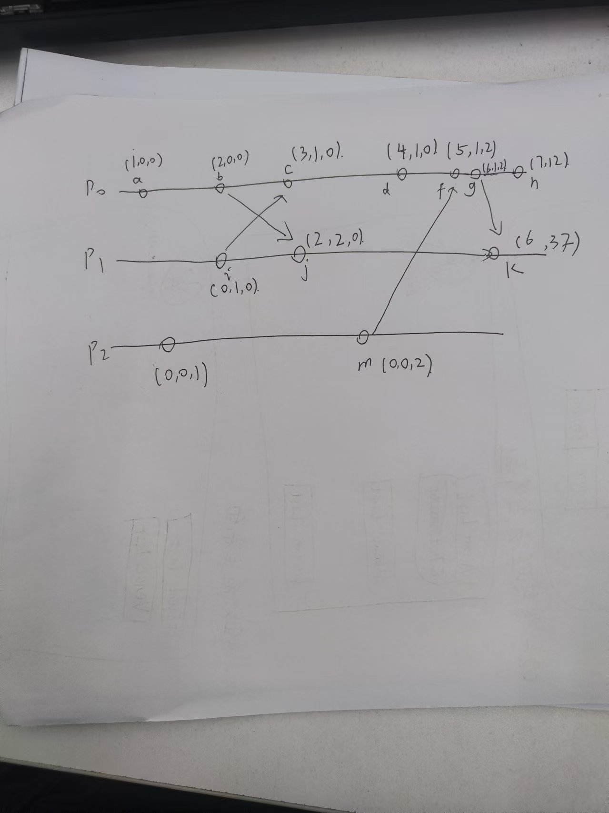

### Figure 1 describes three processes P0, P1 and P2, and there are several events that occurred in these processes. Mention the Vector time for all the events in the figure. Explain your answer.

1. Event a on $P_0$:
   - Internal event on $p_0$, so increments its clock.
   - Vector clock: (1, 0, 0)
2. Event l on $P_2$:
   - Internal event on $P_2$, so increments its clock.
   - Vector clock: (0, 0, 1)
3. Event b on $P_0$ (sending message to $P_1$):
   - Send event: Before sending the message, $P_0$ increments its clock.
   - Vector clock: (2, 0, 0)
   - This vector clock (2,0,0) is sent with the message to $P_1$.
4. Event i on $P_1$ (sending message to $P_0$):
   - Send event: Before sending the message, $P_1$ increments its clock.
   - Vector clock: (0, 1, 0)
5. Event c on $P_0$  (receiving message from $P_1$):
   - This is a receive event. First, $P_0$ increments its own clock, then it updates its vector clock by taking the maximum of its own clock and the received vector.
   - Vector clock: (3, 1, 0)
6. Event j on $P_1$  (receiving message from $P_0$​):
   - This is a receive event. First, $P_1$​ increments its own clock, then it updates its vector clock by taking the maximum of its own clock and the received vector.
   - Vector clock: (2, 2, 0)
7. Event d on $P_0$:
   - Internal event on $p_0$, so increments its clock.
   - (4,1, 0)
8. Event m on $P_2$ (sending message to $P_0$):
   - Send event: Before sending the message, $P_2$ increments its clock.
   - Vector clock: (0, 0, 2)
9. Event f on $P_0$ (receiving message from $P_2$):
   - This is a receive event. First, $P_0$ increments its own clock, then it updates its vector clock by taking the maximum of its own clock and the received vector.
   - Vector clock: (5, 1, 2)

10. Event g on $P_0$ (sending message to $P_1$):
    - Send event: Before sending the message, $P_0$ increments its clock.
    - Vector clock: (6, 1, 2)
    - This vector clock (6, 1, 2) is sent with the message to $P_1$.

11. Event h on $P_0$:
    - Internal event on $p_0$, so increments its clock.
    - Vector clock: (7, 1, 2)
12. Event k on $P_1$(receiving message from $P_0$):
    - This is a receive event. First, $P_1$ increments its own clock, then it updates its vector clock by taking the maximum of its own clock and the received vector.
    - Vector clock: (6, 3, 2)

### What is mutual exclusion?

In a Distributed System, ensuring that a shared resource is accessed by only one process at a time—achieving mutual exclusion. This is because simultaneous access to shared resources by multiple processes, which might be located on different machines, can lead to data inconsistencies or corruption if not properly managed.

### Briefly discuss (one sentence per topic) each of the centralized, distributed and token ring mutual exclusion techniques under the following topics; fairness, resource use time/efficiency, failure.

1. Centralized Mutual Exclusion：

**Fairness**: The central coordinator can enforce a fair, ensuring each request is handled sequentially.

**Resource Use Time/Efficiency**: It can be efficient with low overhead for smaller systems but becomes a bottleneck as the number of processes grows.

**Failure**: There is a single point of failure.

2. Distributed Mutual Exclusion:

**Fairness:** Fairness depends on the algorithm. (eg: Ricart-Agrawala ensures fair access by processing requests in strict time stamp order)

**Resource Use Time/Efficiency:** High communication overhead reduces efficiency as each request involves multiple messages.

**Failure**: Multiple points of failure can block access if a process crashes, requiring ACKs to manage failures.

3. Token-Ring Mutual Exclusion:

**Fairness:** everyone gets a shot at grabbing the token at some stage.

**Resource Use Time/Efficiency:**  Efficiency may decrease as the number of processes grows, since each must wait for the token to circulate.

**Failure: ** If the token is lost , mutual exclusion halts until a recovery mechanism restores the token.

###What do we mean by Election Algorithms? Illustrate the workings of the bully algorithm with an illustrative example. Explain the step-by-step procedure in the election of the COORDINATOR.

An Election Algorithm selects a single leader process (e.g., as a central server), ensuring all processes agree on this choice, and the leader serves until it retires or fails.

Assumes that each process has a unique identifier (ID), and higher IDs have priority. Each process knows the ID and address of every other  process.

1. Initiating an Election: When a process (let’s call it Process P) detects the coordinator is down, it initiates an election. It sends an election message to all processes with higher IDs.
2. If P has the highest process id, it sends a Victory message to all other processes and   becomes the new Coordinator. Otherwise, P broadcasts an Election message to all other   processes with higher process IDs than itself.
3.  If P receives no Answer after sending an Election message, then it broadcasts a Victory   message to all other processes and becomes the Coordinator.
4.  If P receives an Answer from a process with a higher ID, it sends no further messages for  this election and waits for a Victory message
5.  If P receives an Election message from another process with a lower ID it sends an   Answer message back and starts the election process at the beginning, by sending an   Election message to higher-numbered processes.
6. If P receives a Coordinator message, it treats the sender as the coordinator.

### Briefly describe what stateful and stateless file services are. List two advantages and disadvantages of each?

**Stateful**: The File Server keeps a copy of a requested file in memory until the client has finished with it.

Advantage:

- Fewer disk accesses.
- Allows for optimizations like read-ahead for sequential file access

Disadvantage:

-  loses all its volatile state in a  crash
-  Requires memory management to reclaim space from inactive clients.

**Stateless**: Each request is treated independently, requiring complete file information for every access without needing an open/close connection.

Advantage:

- Simplifies failure recovery, as a server can restart and continue handling requests.
- No need to track client-specific states, making it more scalable.

Disadvantage:

- Longer, more complex request messages.
- Slower processing, as repeated information is needed with every request.

### What is a flat file system? Describe the architecture of a flat file system. Write a sentence discussing each of its 3 main components.

A flat file system is a system of files in which every file in the system must have a different name.

**Flat File Service:** Manages file content operations using unique file identifiers (UFIDs) for each file.

**Directory Service:** Maps human-readable file names to UFIDs and supports directory management.

**Client Module:** Integrates FFS and Directory Service for client access, with caching and mounting functionalities for seamless remote file access.

### Research the Sun Network File System (NFS) mentioned in lecturers. Write down 3-4 points (bullet point format will suffice) regarding each of the following aspects of the file system

**Objective**

- Support file system sharing  between networked workstations
- Supports heterogeneous systems, compatible with different OS and hardware.
- Stateless design simplifies recovery and resilience.

**Security**

- Each RPC request includes authentication, as NFS does not maintain session stat
- Kerberos and DES encryption options strengthen authentication.

**Naming**

- Uses path-based naming for local and remote access uniformity.
- Virtual file system (VFS) provides a unified namespace across clients.
- Allows location transparency, letting users access files by path alone.

**File Access Model**

- Implements a remote access model where files are accessed directly on the server.
- No full file download needed, reducing network load.
- Real-time access allows immediate file interaction.

**Cache Update**

- NFS periodically flushes cached data to disk every 30 seconds, ensuring delayed writes are synchronized with storage to maintain consistency and reduce data loss risks.

- Server Caching: NFS server maintains an in-memory buffer cache for file and directory pages, using write-through and write-on-commit policies.
- Client Caching: NFS client caches read, write, and lookup operations with timestamps to check validity.

**Consistency**

- Timestamp-based validation maintains consistency between client and server.

- Achieves close-to-open consistency by updating visibility after file closure.
- Ensures regular freshness checks to minimize stale data.

**Other Relevant Information**

- Stateless protocol allows easy client and server recovery after failure.
- Designed for high performance, capable of handling large-scale operations.
