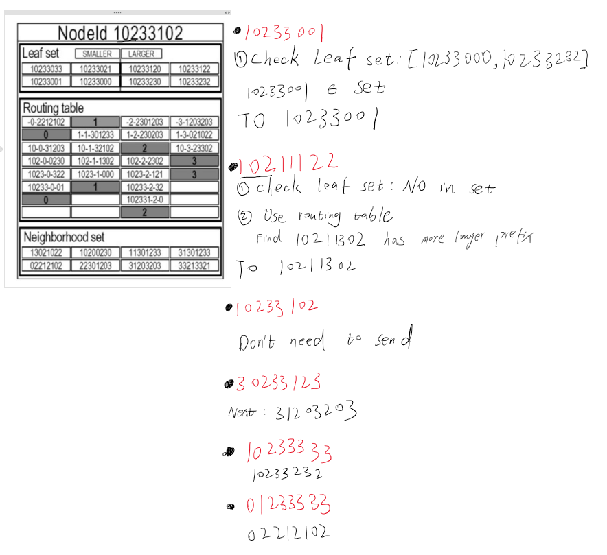
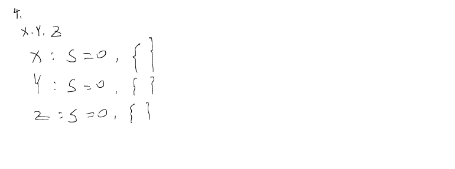
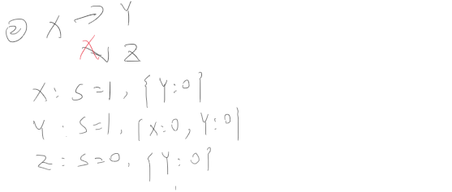
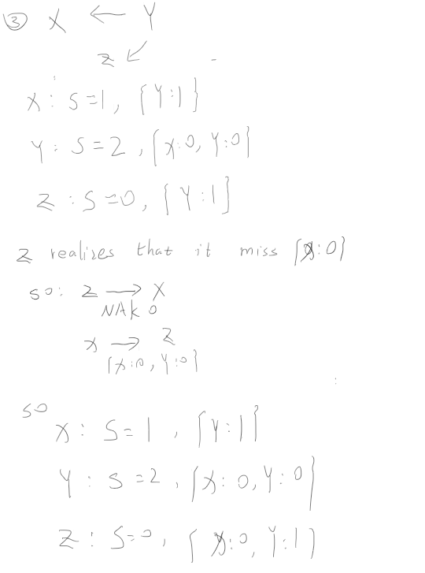
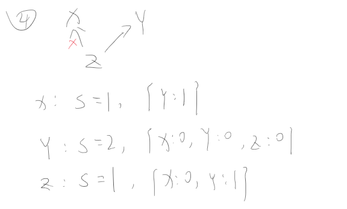
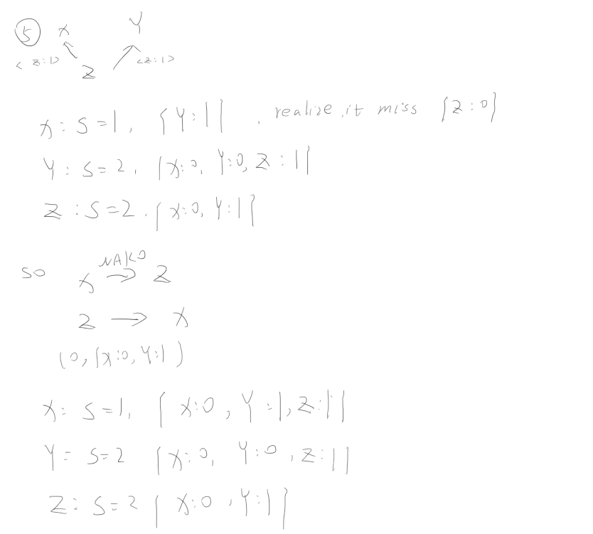

# Distributed System Tutorial #3

1. **What is routing? What criteria are considered during a 'routing decision'?**

Routing is the process used in a network to determine the path for data packets from the source address to the destination address.

Routing decisions need to consider:

**Scalability**: Ensuring efficient routing path decisions even as the number of nodes increases.

**Load Balancing**: Distributing the load across nodes to avoid overloading certain nodes.

**Network Dynamics**: Considering the addition, removal, and failure of nodes. Routing decisions should adapt to these changes.

**Fault Tolerance**: Considering backup routes.

**Target Identification**

**Security and Anonymity**

2. **What is an overlay? Briefly describe what a routing overlay is.**

**Overlay** is used to clarify that it is an application layer routing mechanism (it is not a network layer mechanism like IP routing).

**Routing overlay** is the logical structure that implements routing functionality. It forwards messages between nodes based on specific algorithms to ensure fast communication. It directs the request to a node on which a replica (or the original) of the resource resides. It is also responsible for adding and removing resource nodes and creating GUIDs for them.

3. **Pastry Node Routing Decision**

4.  **Reliable Multicast**

5.  **Briefly explain the gossip architecture. Give an example of when it may be necessary to sacrifice consistency for high availability.**

The Gossip architecture is a  framework  for implementing highly  available  services.

A node receives or generates new information. It randomly selects one or more nodes to share the information. The receiving nodes continue propagating the information to their peers. The process repeats until the information has been shared with all nodes.

 Offline Payment Authorization

- In scenarios where network connectivity is limited, payment systems like credit cards or mobile wallets allow offline authorization of transactions.

- Reason for Sacrificing Consistency:
  - Enforcing consistency would require real-time verification, causing delays or failures in areas with poor connectivity.
- Outcome:
  - Transactions might be temporarily processed offline, with conflicts (e.g., insufficient funds) resolved during later reconciliation.

6. **What are Symmetric and Asymmetric Encryption algorithms?**

Symmetric encryption uses the same key for encryption and decryption, requiring secure key sharing. Asymmetric encryption (Public Key Cryptography) uses a pair of keys. The private key used for signing is referred to as the signature key and the public key as the verification key.

7. **What are the main differences between capability lists and access lists?**

> From DISTRIBUTED SYSTEMS Concepts and Design Fifth Edition 

>  Capabilities: A set of capabilities is held by each process according to the domain in 
which it is located.

>  Access control lists: A list is stored with each resource, containing an entry of the form 
<domain, operations> for each domain that has access to the resource and giving the 
operations permitted to the domain. 

Capability Lists: Stored with each subject (e.g., user, process) and list the resources they can access and the allowed operations. Verification is efficient as the request includes the capability (proof of access). Vulnerable to theft or misuse, and revoking capabilities is complex.

Access Control Lists: Stored with each resource and list the subjects allowed to access it and their permissions. The server checks the resource's access list to verify the subject's permission.

8. **What do we mean by public key cryptography algorithms? Why are they generally used?**

Public key cryptography algorithms use two keys: a public key for encryption and a private key for decryption. They are mainly used for secure key exchange, digital signatures, and ensuring confidentiality and authenticity without sharing private keys

9. **Define the Bell-LaPadula security model.**

The approach taken is to 
assign security levels to information and channels and to analyze the flow of information.  into channels with the aim of ensuring that high-level information cannot flow into 
lower-level channels. (DISTRIBUTED SYSTEMS Concepts and Design Fifth Edition )

> Form wikipedia.org
> 
> With Bell–LaPadula, users can create content only at or above their own security level (i.e. secret researchers can create secret or top-secret files but may not create public files; no write-down). Conversely, users can view content only at or below their own security level (i.e. secret researchers can view public or secret files, but may not view top-secret files; no read-up).

10.  **Explain grid computing.**

From DISTRIBUTED SYSTEMS Concepts and Design Fifth Edition 

The name ‘Grid’ is used to refer to middleware that is designed to enable the sharing of 
resources such as files, computers, software, data and sensors on a very large scale.
Grid computing can generally be viewed as a precursor to the more general paradigm 
of cloud computing with a bias towards support for scientific applications.

11. **What are the primary requirements of a computing grid?**

From DISTRIBUTED SYSTEMS Concepts and Design Fifth Edition 

- Remote access to resources
- Processing of data at the site where it is stored and managed.
- The resource manager of a data archive should be able to create service instances 
dynamically to deal with the particular section of data required.
- Directory services.
-  Software to manage queries, data transfers and advance reservation of resources,